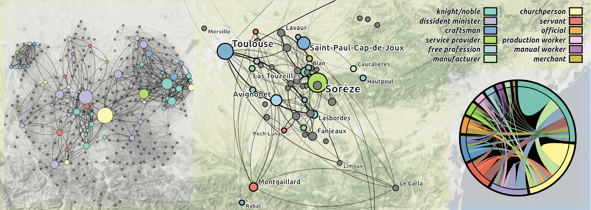
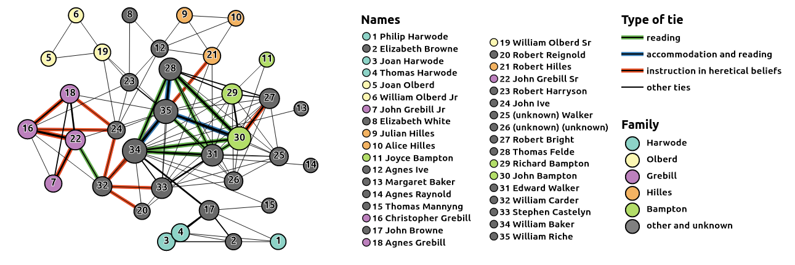
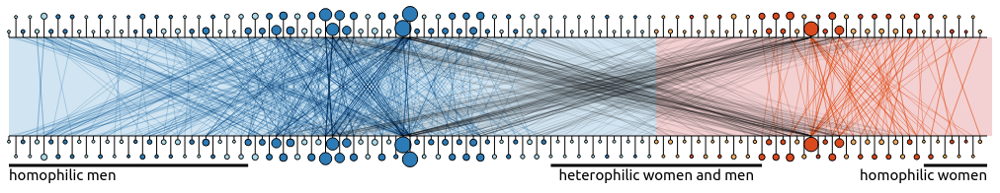
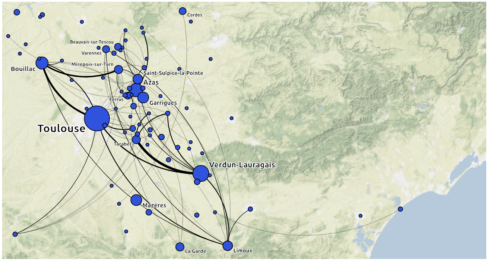
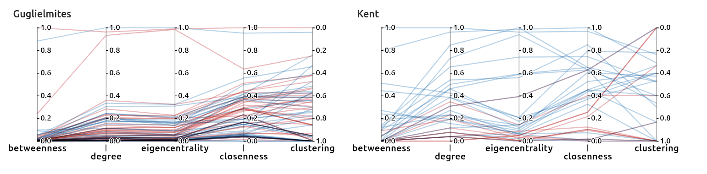

# List of visualizations made for DISSINET project (dissinet.cz)

- *Regtou - composition*
A composition of three charts - map, sna graph and chord graph for the dataset of Register of Toulouse

- *Kent - SNA*
SNA graph visualization of Kent register actors and their ties 

- *Coventry - Homophily graph*
Chart visualizing the homophily in the dataset of heretics from Coventry register

- *GuiSent - map*
Simple map visualization showing places of residents from the actors of GuiSent registry

- *Parallels coordinates centralities*
Parallels coordinates graphs showing various centrality measurements of two datasets
 